# 1.DevOps Accelerator: End-to-End Cloud-Native Project

A fully integrated cloud-native DevOps and DevSecOps platform demonstrating real-world software delivery practices including Infrastructure as Code, CI/CD automation, containerized deployment, serverless architecture, security automation, and monitoring.
The project implements an enterprise-style workflow using AWS, Terraform, Jenkins, Docker, Kubernetes, and DevSecOps security tools to automate infrastructure provisioning, application deployment, vulnerability detection, and continuous security monitoring.


---

## 2.Project Overview

The DevOps Accelerator Platform enables users to:
•	Upload files securely through a frontend application hosted on AWS.
•	Generate temporary secure upload links using API Gateway and Lambda pre-signed URLs.
•	Store files securely in Amazon S3.
•	Process uploaded files automatically using S3 Events and AWS Lambda.
•	Receive upload notifications through Amazon SNS.
•	Deploy a containerized FastAPI File Management API using Docker and Amazon EKS.
•	Provision AWS infrastructure using Terraform Infrastructure as Code.
•	Automate CI/CD workflows using Jenkins.
•	Perform continuous security validation using multiple DevSecOps tools.
•	Monitor application and infrastructure health using Prometheus, Grafana, and CloudWatch.


---
## 3. What is the DevOps Accelerator Platform?
The DevOps Accelerator Platform is a cloud-native application platform that demonstrates how modern applications are designed, deployed, secured, and monitored using DevOps and DevSecOps practices.
•	Web frontend application
•	Serverless file upload workflow
•	Secure S3 upload mechanism using pre-signed URLs
•	AWS Lambda-based processing
•	FastAPI File Management API
•	Docker containerization
•	Amazon ECR container registry
•	Amazon EKS Kubernetes deployment
•	Terraform Infrastructure as Code
•	Jenkins CI/CD pipeline
•	Automated security scanning
•	AI integration using FastAPI + Ollama LLM
•	Monitoring using Prometheus, Grafana, and CloudWatch


## 3. High-Level Architecture
                     Developer
                         |
                  GitHub Repository
                         |
                    Jenkins CI/CD
                         |
        -----------------------------------
        |          Security Pipeline       |
        -----------------------------------
        
         -- Gitleaks (Secret Detection)
         -- Terraform Validate
         -- Docker Build
         -- Trivy Container Scan
         -- Push Image to ECR
         -- Deploy to EKS
         -- OWASP Dependency Check
         -- SonarQube SAST Analysis
         -- Checkov IaC Scan
         -- OWASP ZAP DAST Scan
         -- Security Report Generation
                         |
                    Amazon ECR
                         |
                    Amazon EKS
                         |
              File Management API
                 FastAPI + Docker
                         |
              ----------------------
              |                    |
             S3              AI API Server
          File Storage       FastAPI + Ollama
              |                    |
          Lambda              Gemma LLM
          Processing
              |
             SNS
        Email Notification

## 4. Application Flow
Secure File Upload Workflow

User Browser
      |
Frontend Application (S3 Hosting)
      |
Request Upload URL
      |
API Gateway
      |
Lambda - Generate Pre-Signed URL
      |
Amazon S3
      |
S3 Object Created Event
      |
Processing Lambda
      |
SNS Email Notification

Workflow
•	User accesses the frontend application.
•	User uploads JPG, PNG, or PDF files.
•	Frontend requests a temporary upload URL.
•	API Gateway invokes Lambda.
•	Lambda generates an S3 pre-signed URL.
•	Frontend uploads directly to S3.
•	S3 event triggers processing Lambda.
•	Lambda validates uploaded files.
•	SNS sends notification after successful processing.

---
## 5. Containerized Application Flow

Developer
   |
GitHub
   |
Jenkins Pipeline
   |
Docker Build
   |
Trivy Security Scan
   |
Amazon ECR
   |
Amazon EKS
   |
FastAPI File Management API


## 6.Tech Stack


---


## 7. What's Covered in this DevOps Accelerator Platform
7.1 Infrastructure Automation with Terraform
Implemented Infrastructure as Code using Terraform.
Provisioned AWS resources:
•	Amazon VPC
•	IAM Roles and Policies
•	Amazon EKS Cluster
•	Amazon ECR Repository
•	Amazon S3 Buckets
•	Lambda Functions
•	API Gateway
•	SNS TopicsTerraform backend:
•	Amazon S3 → State Storage • DynamoDB → State Locking
Benefits: repeatable infrastructure deployment, version-controlled infrastructure, and automated cloud provisioning.

#### 7.2 End-to-End DevSecOps CI/CD Pipeline
Implemented a complete Jenkins pipeline covering source management, security validation, containerization, deployment, and reporting


Deployment pipeline:
•	Docker Image Build
•	Security Scan
•	Push Image to Amazon ECR
•	Deploy Application to Amazon EKS
•	Generate Security Reports

#### 7.3 Cloud-Native Application Deployment
The platform uses both serverless and container-based architecture.
Serverless components:
•	Frontend hosted on Amazon S3
•	API Gateway
•	Lambda Functions
•	S3 Event Processing
•	SNS Notifications
Containerized component — File Management API:
•	Developed using FastAPI
•	Containerized using Docker
•	Stored in Amazon ECR
•	Deployed on Amazon EKS Kubernetes Cluster


#### 7.4 Secure File Upload System
Implemented secure file upload using API Gateway, Lambda, and S3 pre-signed URLs.
Security advantages:
•	No public S3 write access
•	Temporary upload permissions
•	Controlled file uploads
•	Reduced attack surface


#### 7.5 AI Integration Module
Implemented an independent AI service.
User Request
     |
FastAPI AI API
     |
Ollama Server
     |
Gemma LLM
     |
AI Response
•	AI-based responses
•	Independent microservice design
•	Future-ready for RAG implementation


#### 7.6 Monitoring and Observability
Implemented complete monitoring solution.
Kubernetes monitoring using Prometheus and Grafana:
•	Cluster health
•	Node metrics
•	Pod status
•	CPU utilization
•	Memory usage
•	Application metrics
AWS monitoring using CloudWatch Logs and CloudWatch Metrics.
CI/CD monitoring using Jenkins Reports, Build Artifacts, and Security Reports.


#### 7.7 Automated Security Reporting
Configured scheduled Jenkins execution:
triggers {     cron('H H * * *') }
Generated reports:
•	Trivy Container Report
•	Checkov IaC Report
•	OWASP Dependency Report
•	OWASP ZAP DAST Report
•	SonarQube Analysis Report
Reports are archived as Jenkins build artifacts for review and auditing.


#### 7.8 Project Repository Structure
```

devops-accelerator-devsecops/
│
├── frontend/
│
├── backend/
│   └── lambda/
│
├── file-management-api/
│   ├── Dockerfile
│   ├── requirements.txt
│   └── app/
│
├── k8s/
│   ├── deployment.yaml
│   └── service.yaml
│
├── infra/
│   └── terraform/
│
├── Jenkinsfile
│
├── zap.yaml
│
└── README.md
---


```
DevOps-Accelerator-Project
├── .github
│   └── workflows
│       ├── backend-deploy.yml
│       ├── frontend.yml
│       └── terraform.yml
├── backend
│   └── lambda
│       ├── generate-presigned-url
│       │   ├── lambda.zip
│       │   └── main.py
│       └── process-uploaded-file
│           ├── lambda.zip
│           └── main.py
├── frontend
│   └── index.html
├── gigs
│   ├── project-generator
│   └── qa-bot
├── infra
│   └── terraform
│       ├── main.tf
│       ├── outputs.tf
│       ├── terraform.tfvars
│       └── variables.tf
└── README.md
└── .gitignore

```

## 📸 Project Screenshots

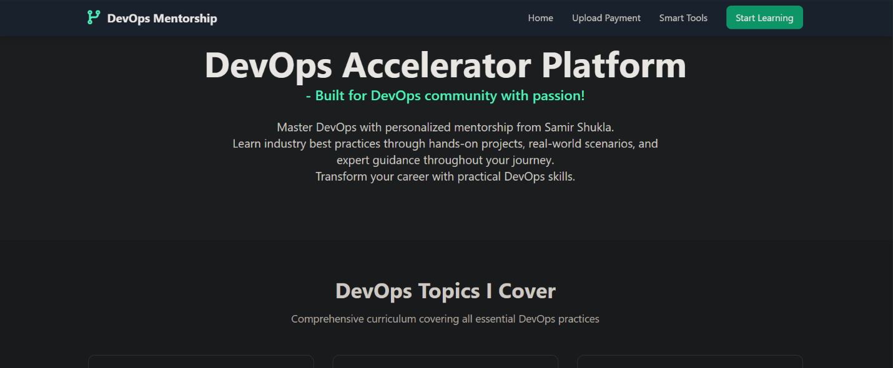
## 📸 Project Screenshots


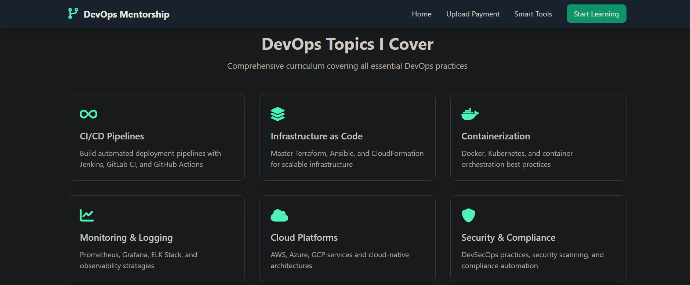

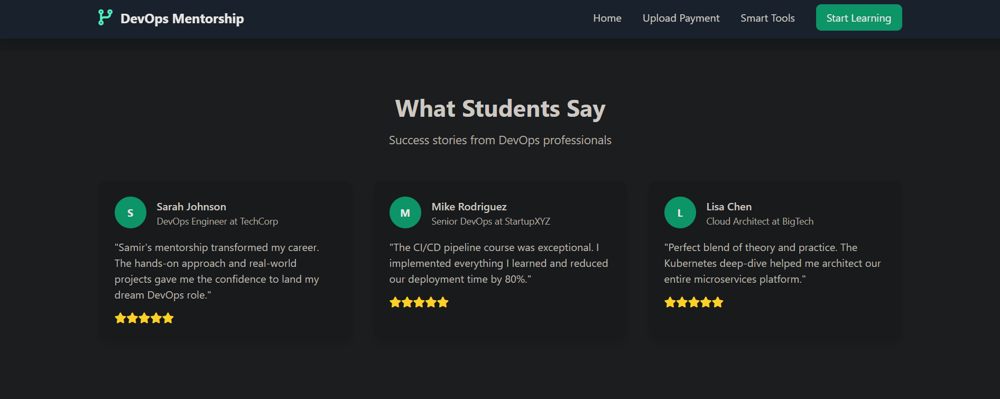

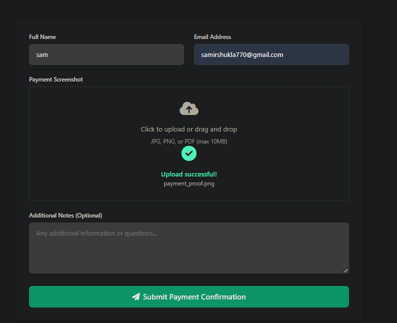

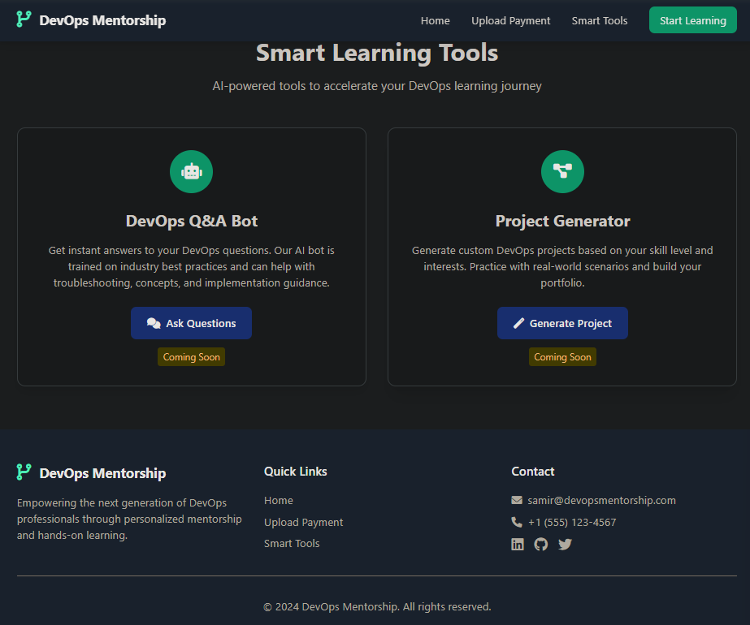

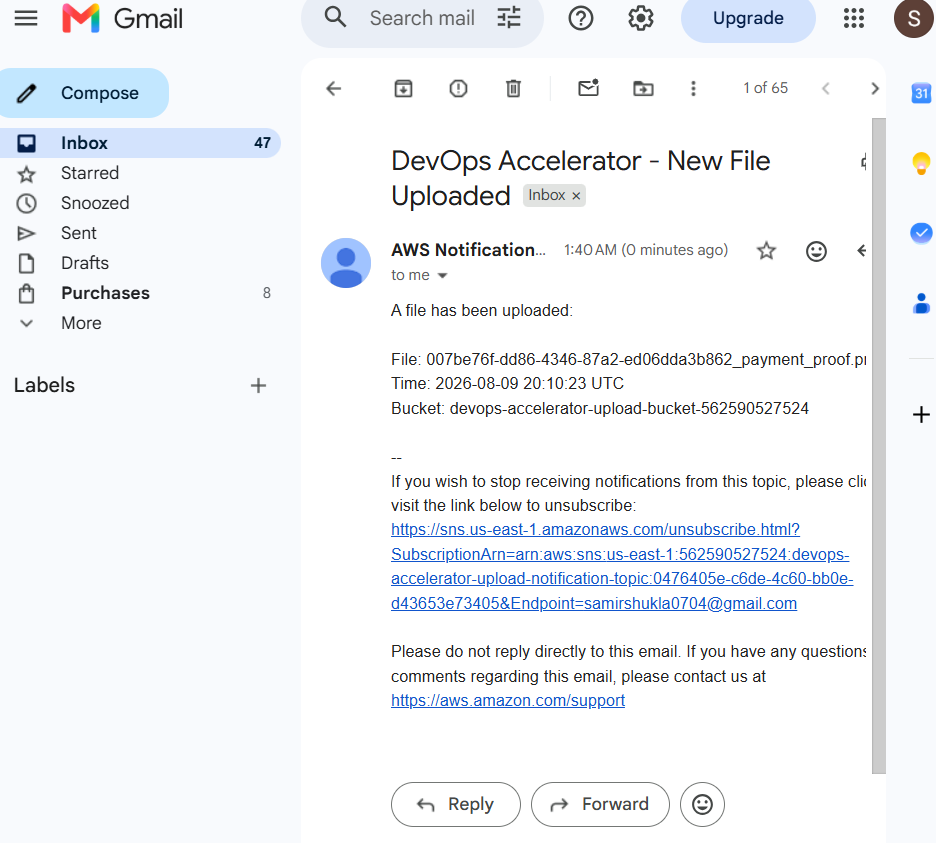

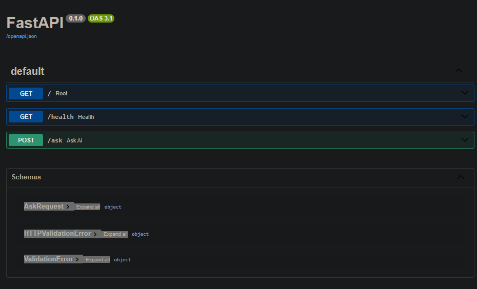

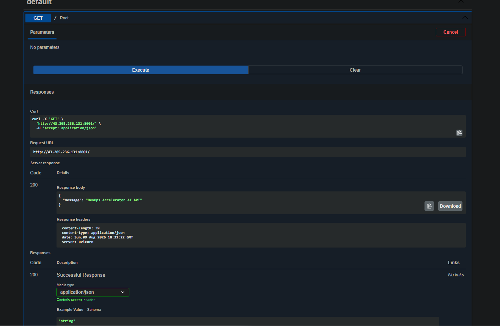
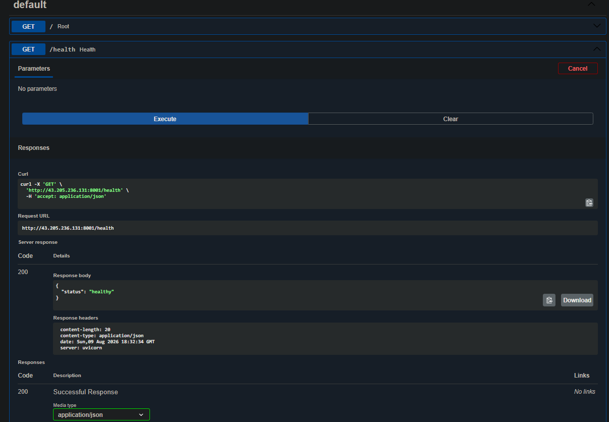

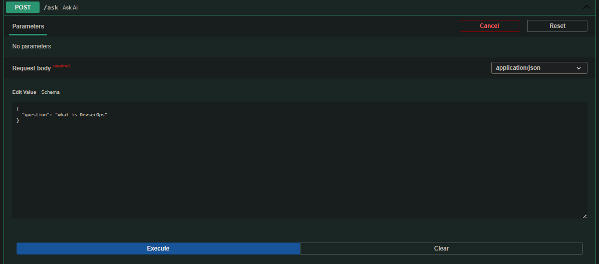

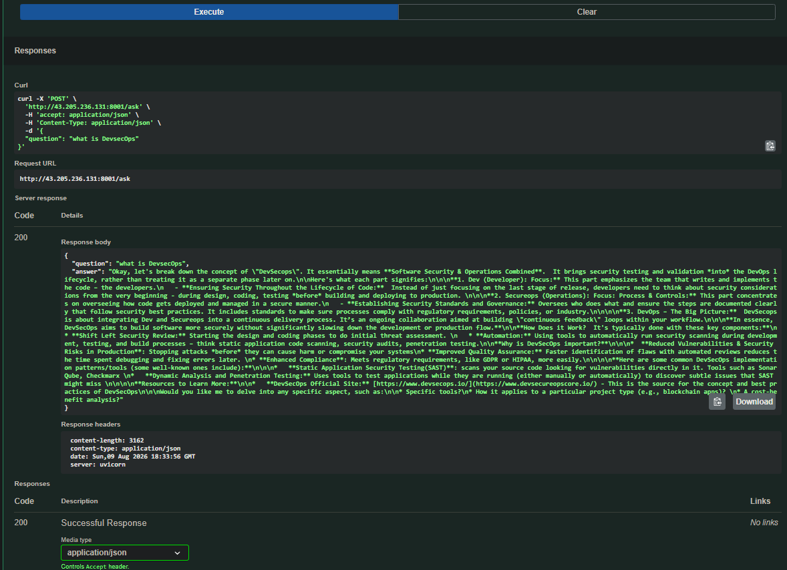

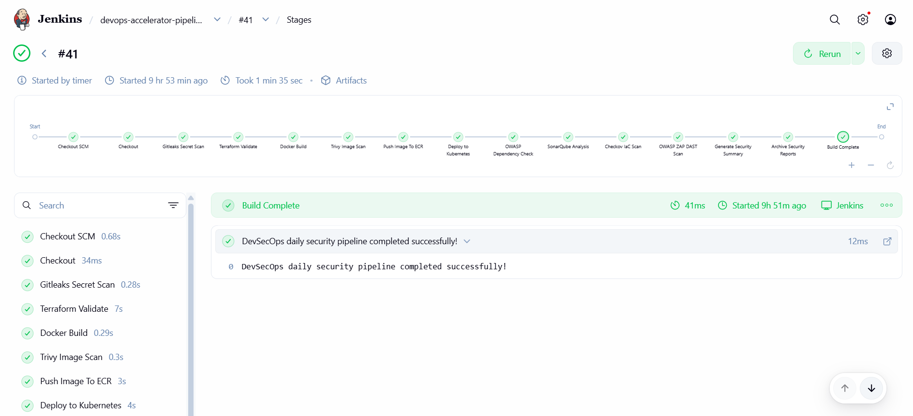

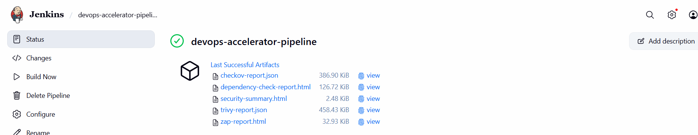

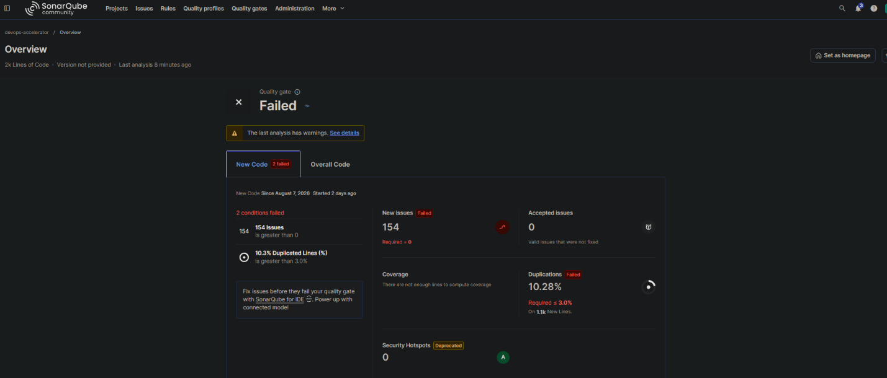

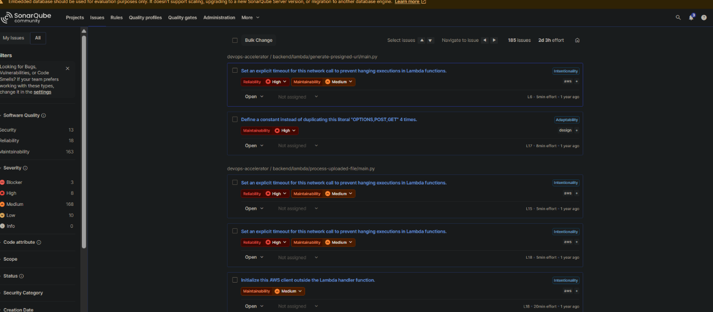

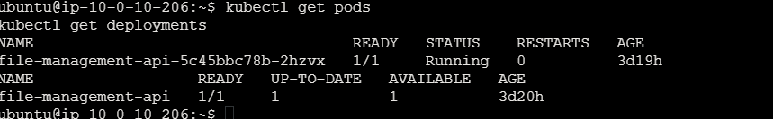
